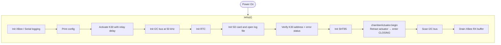
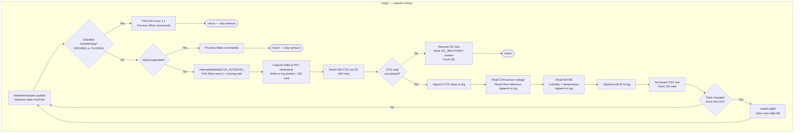
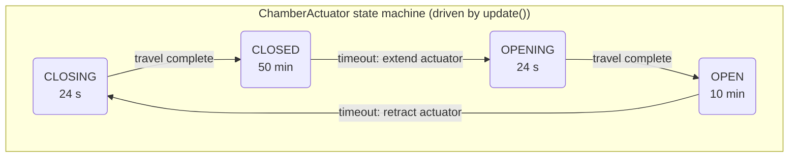

# Activity Diagram

## Setup

```mermaid
flowchart TD
    START([Power On]) --> SETUP

    subgraph SETUP["setup()"]
        S1[Init XBee / Serial logging] --> S2[Print config]
        S2 --> S3[Activate K30 with relay delay]
        S3 --> S4[Init I2C bus at 50 kHz]
        S4 --> S5[Init RTC]
        S5 --> S6[Init SD card and open log file]
        S6 --> S7[Verify K30 address + error status]
        S7 --> S8[Init SHT85]
        S8 --> S9[chamberActuator.begin\nRetract actuator → enter CLOSING]
        S9 --> S10[Scan I2C bus]
        S10 --> S11[Drain XBee RX buffer]
    end

```

## Loop

```mermaid
flowchart TD

    subgraph LOOP["loop() — repeats forever"]
        L1[chamberActuator.update\nAdvance state machine] --> L2{Chamber\ntransitioning?\nOPENING or CLOSING}

        L2 -->|Yes| L3[Print dot every 1 s\nProcess XBee commands] --> L2_RETURN([return — skip sensors])

        L2 -->|No| L4{xbeeSuspended?}

        L4 -->|Yes| L5[Process XBee commands] --> L4_RETURN([return — skip sensors])

        L4 -->|No| L6["interruptibleWait(LOG_INTERVAL)\nPoll XBee every 1 s during wait"]

        L6 --> L7[Capture millis & RTC timestamp\nWrite to log stream + SD card]

        L7 --> L8[Read K30 CO2 via I2C\nwith retry]
        L8 --> L9{CO2 read\nsucceeded?}
        L9 -->|No| L10[Recover I2C bus\nWrite I2C_RECOVERY marker\nFlush SD] --> L10_RETURN([return])
        L9 -->|Yes| L11[Append CO2 value to log]

        L11 --> L12[Read CH4 sensor voltage\nRead Vbat reference\nAppend to log]

        L12 --> L13[Read SHT85\nhumidity + temperature\nAppend to log]

        L13 --> L14[Append unit ID to log]

        L14 --> L15[Terminate CSV row\nFlush SD card]

        L15 --> L16{Date changed\nsince last row?}
        L16 -->|Yes| L17[rotateLogfile\nOpen new daily file] --> L1
        L16 -->|No| L1
    end

```

## Chamber State Machine

```mermaid
flowchart TD

    subgraph CHAMBER["ChamberActuator state machine (driven by update())"]
        direction LR
        C1(CLOSING\n24 s) -->|travel complete| C2(CLOSED\n50 min)
        C2 -->|timeout: extend actuator| C3(OPENING\n24 s)
        C3 -->|travel complete| C4(OPEN\n10 min)
        C4 -->|timeout: retract actuator| C1
    end

```
